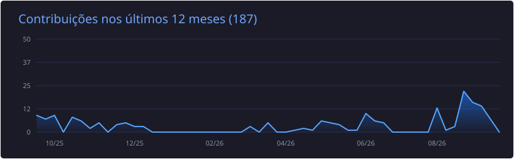
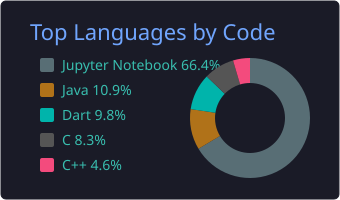

  

  

 

## 💻 Tecnologias

**Linguagens & Frameworks**

**Ferramentas**

 

## 🤝 Contribuições em Open Source

<table>
<tr><td align="center" width="620">

🪨 <i>Claude Code skill que corta ~65% dos tokens falando como caveman</i>

<code>fix(stats): count each API response once, not once per content-block line</code>

</td></tr>
</table>

 

## 📊 Estatísticas

  

  
  

  

  

 

  <picture>
    <source media="(prefers-color-scheme: dark)" srcset="https://raw.githubusercontent.com/pedrohlmelo/pedrohlmelo/output/github-contribution-grid-snake-dark.svg"/>
    <source media="(prefers-color-scheme: light)" srcset="https://raw.githubusercontent.com/pedrohlmelo/pedrohlmelo/output/github-contribution-grid-snake.svg"/>
    
  </picture>

 

  

